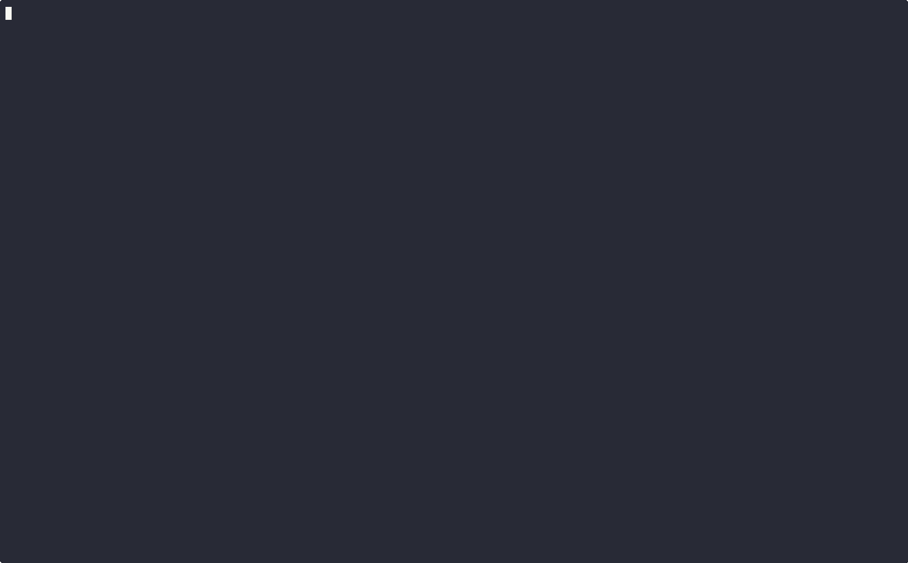

# DepCheck

A CLI tool to check dependency versions across different package ecosystems and identify security vulnerabilities.



## Installation

```bash
go install github.com/harekrishnarai/depcheck@latest
```

## Usage

### Check a single package version

```bash
depcheck check express 4.18.2
```

### Check dependencies from a package file

```bash
depcheck file package.json
```

### Check dependencies directly from a lock file

```bash
depcheck file package-lock.json
```

## Supported Package Files

- Node.js
  - package.json
  - package-lock.json (improved accuracy with exact versions)
  - yarn.lock
  - npm-shrinkwrap.json
- Python (requirements.txt)
- More coming soon...

## Features

- Check if specific package versions exist
- Bulk check dependencies from package files
- Support for lock files for more accurate version information
- Transitive dependency analysis (detects nested dependencies)
- Security vulnerability scanning with accurate CVSS scores
- Detailed severity information from multiple sources (OSV.dev, deps.dev)
- Support for multiple package ecosystems
- Detailed version information

## Security Features

- Vulnerability scanning from multiple sources
- Accurate CVSS score parsing from vector strings
- Proper severity classification (Critical, High, Medium, Low)
- Detects deprecated packages
- Shows fixed version information

## Development

To build and run locally:

```bash
go build
./depcheck --help
```

## Recent Updates

- Added support for direct lock file analysis
- Implemented transitive dependency detection
- Enhanced CVSS vector parsing for accurate vulnerability scores
- Improved handling of GitHub Security Advisories
